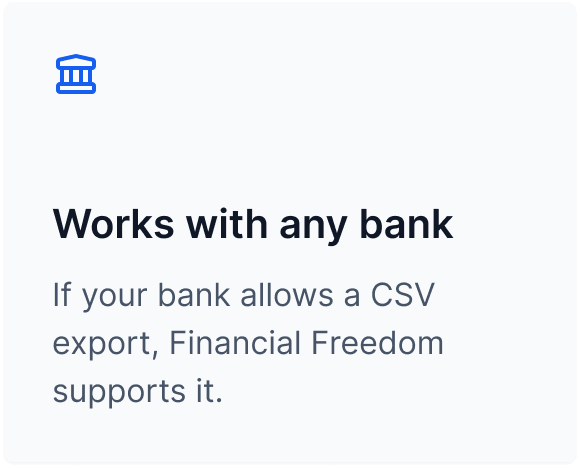
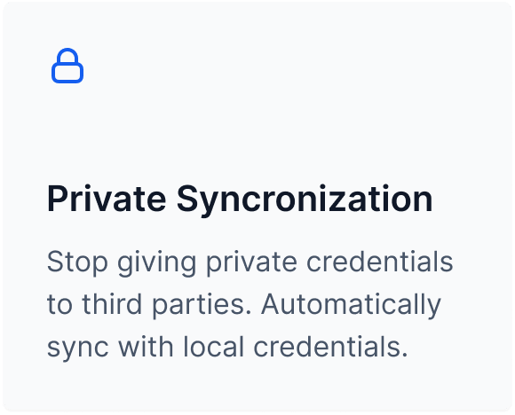
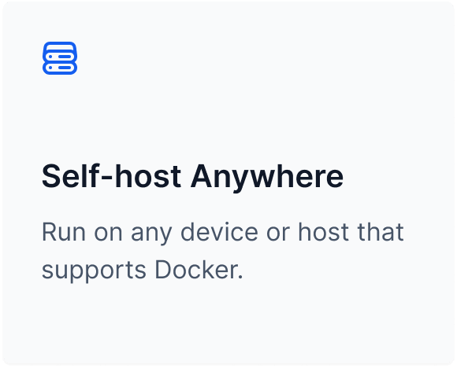
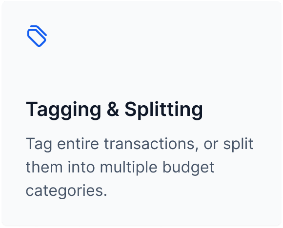
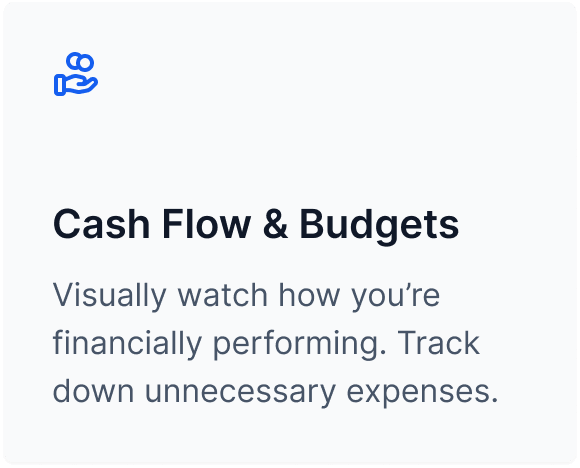
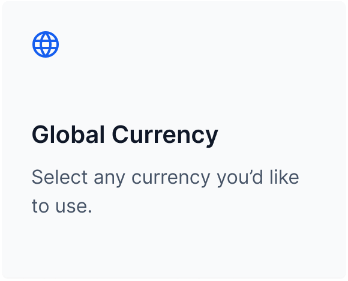

		

	
	
	

	

## Introduction
`Financial Freedom` is an open source alternative to Mint, YNAB, and more. With open source at its core, you have the freedom to review exactly what's happening with your data and participate in the improvement of the product.

Break free from third parties tracking every financial footstep you have. Run this application on any device or host that supports Docker -- if that's something like AWS, Digital Ocean, or even your own Raspberry Pi running in your basement.

> [!WARNING]  
> **This product is actively being developed.** This started as a fun side project that took off faster than we expected. We're currently revamping the product to make it easier for everyone to use and contribute.

**Here's what you can do right now:**
- **[Watch our progress](https://github.com/orgs/serversideup/projects/6/views/2)**: Watch us in realtime with GitHub projects.
- **[Join our Discord](https://serversideup.net/discord)**: We're actively discussing the product and how to make it better.
- **[Star us on GitHub](https://github.com/serversideup/financial-freedom/stargazers)**: Give us confidence that we're solving a problem that you care about.
- **[Follow Twitter](https://twitter.com/serversideup)**: We post frequent updates. Check our personal accounts too. ([Dan](https://twitter.com/danpastori) & [Jay](https://twitter.com/jaydrogers))
- **[Sponsor Us](https://github.com/sponsors/serversideup)**: We're a two person, bootstrapped team. Help us replace client projects with more time for open source projects.

 Features

  

|<picture></picture>|<picture></picture>|<picture></picture>|
|:---:|:---:|:---:|
|<picture></picture>|<picture></picture>|<picture></picture>|

## Contributing
As an open-source project, we strive for transparency and collaboration in our development process. We greatly appreciate any contributions members of our community can provide. Whether you're fixing bugs, proposing features, improving documentation, or spreading awareness - your involvement strengthens the project. Please review our [contribution guidelines](https://serversideup.net/open-source/financial-freedom/docs/community/contributing) and [code of conduct](./.github/code_of_conduct.md) to understand how we work together respectfully.

- **Bug Report**: If you're experiencing an issue while using these images, please [create an issue](https://github.com/serversideup/financial-freedom/issues/new/choose).
- **Feature Request**: Make this project better by [submitting a feature request](https://github.com/serversideup/financial-freedom/discussions/63).
- **Documentation**: Improve our documentation by [submitting a documentation change](./docs/README.md).
- **Community Support**: Help others on [GitHub Discussions](https://github.com/serversideup/financial-freedom/discussions) or [Discord](https://serversideup.net/discord).
- **Security Report**: Report critical security issues via [our responsible disclosure policy](https://www.notion.so/Responsible-Disclosure-Policy-421a6a3be1714d388ebbadba7eebbdc8).

Need help getting started? Join our Discord community and we'll help you out!

## Our Sponsors
All of our software is free an open to the world. None of this can be brought to you without the financial backing of our sponsors.

#### Individual Supporters
<!-- supporters -->&nbsp;&nbsp;&nbsp;&nbsp;&nbsp;&nbsp;<!-- supporters -->

## About Us
We're [Dan](https://twitter.com/danpastori) and [Jay](https://twitter.com/jaydrogers) - a two person team with a passion for open source products. We created [Server Side Up](https://serversideup.net) to help share what we learn.

| 
Dan Pastori
                  | 
Jay Rogers
                                 |
| ----------------------------- | ------------------------------------------ |
| 
 
                        | 
 
                                       |

### Find us at:

* **📖 [Blog](https://serversideup.net)** - get the latest guides and free courses on all things web/mobile development.
* **🙋 [Community](https://community.serversideup.net)** - get friendly help from our community members.
* **🤵‍♂️ [Get Professional Help](https://serversideup.net/professional-support)** - get support via video + screen-sharing from our team.
* **💻 [GitHub](https://github.com/serversideup)** - check out our other open source projects
* **📫 [Newsletter](https://serversideup.net/subscribe)** - skip the algorithms and get quality content right to your inbox
* **🐥 [Twitter](https://twitter.com/serversideup)** - you can also follow [Dan](https://twitter.com/danpastori) and [Jay](https://twitter.com/jaydrogers)
* **❤️ [Sponsor Us](https://github.com/sponsors/serversideup)** - please consider sponsoring us so we can create more helpful resources

## Our products
If you appreciate this project, be sure to check out our other projects.

### 📚 Books
- **[The Ultimate Guide to Building APIs & SPAs](https://serversideup.net/ultimate-guide-to-building-apis-and-spas-with-laravel-and-nuxt3/)**: Build web & mobile apps from the same codebase.
- **[Building Multi-Platform Browser Extensions](https://serversideup.net/building-multi-platform-browser-extensions/)**: Ship extensions to all browsers from the same codebase.

### 🛠️ Software-as-a-Service
- **[Bugflow](https://bugflow.io/)**: Get visual bug reports directly in GitHub, GitLab, and more.
- **[SelfHost Pro](https://selfhostpro.com/)**: Connect Stripe or Lemonsqueezy to a private docker registry for self-hosted apps.

### 🌍 Open Source
- **[AmplitudeJS](https://521dimensions.com/open-source/amplitudejs)**: Open-source HTML5 & JavaScript Web Audio Library.
- **[Spin](https://serversideup.net/open-source/spin/)**: Laravel Sail alternative for running Docker from development → production.
- **[PHP Docker Images](https://github.com/serversideup/financial-freedom)**: Laravel & WordPress optimized PHP Docker Images.